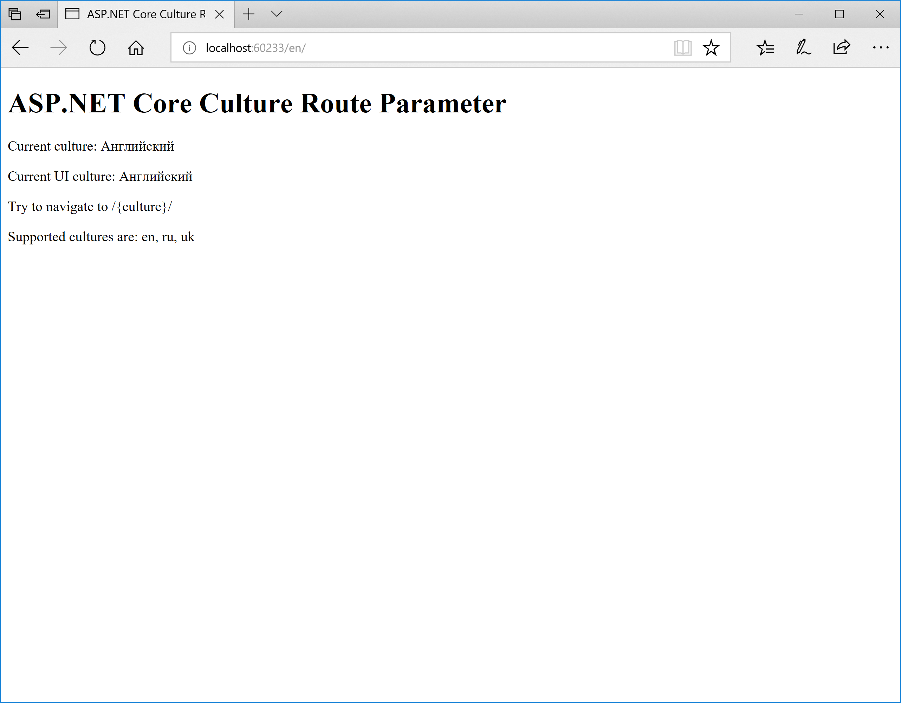

# ASP.NET Core Culture Route Parameter
This is a demo web application for the
“[ASP.NET Core Culture Route Parameter](https://medium.com/@dmitrysikorsky/asp-net-core-culture-route-parameter-4e1310cabacc)”
post on the [Dmitry Sikorsky’s blog](https://medium.com/@dmitrysikorsky).
It shows how to specify culture as the URL segment using the route parameter by overriding the
`DetermineProviderCultureResult` method of the `RequestCultureProvider` class.

The result looks like this:

*ASP.NET Core Culture Route Parameter*

## Using the Application

1. Run the application.
2. Change the culture segment in the URL.
3. Check the current culture and the UI culture in the view.
